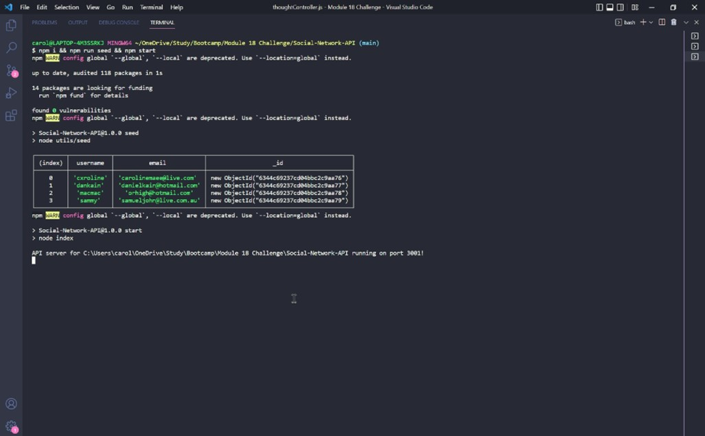
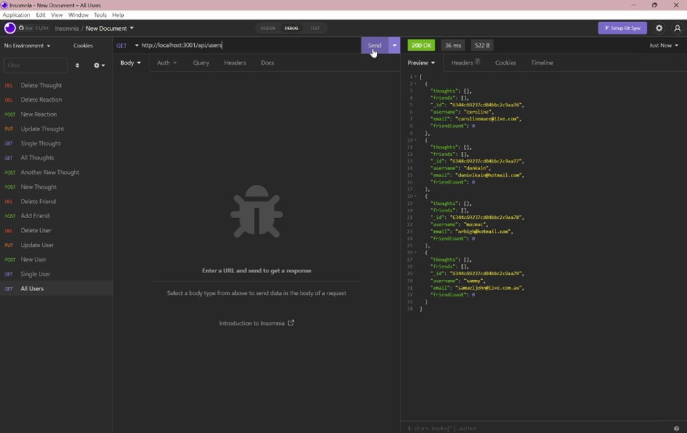
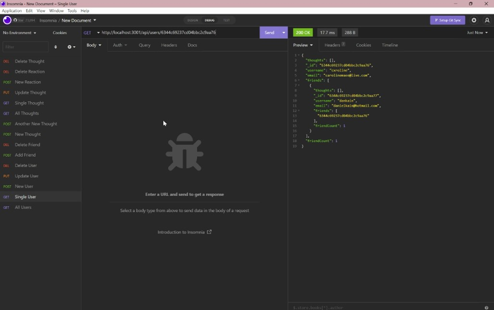
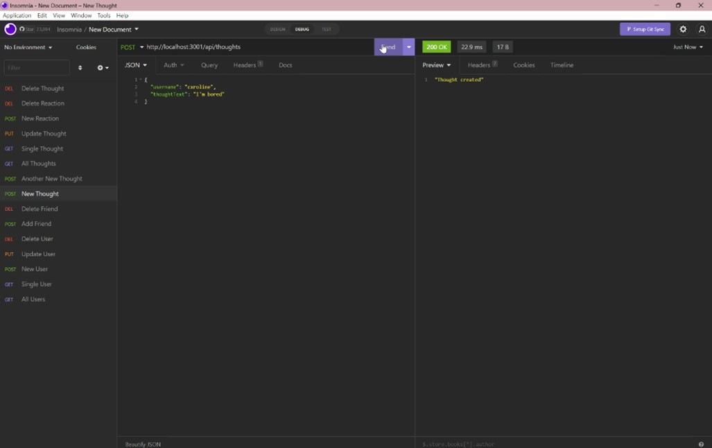
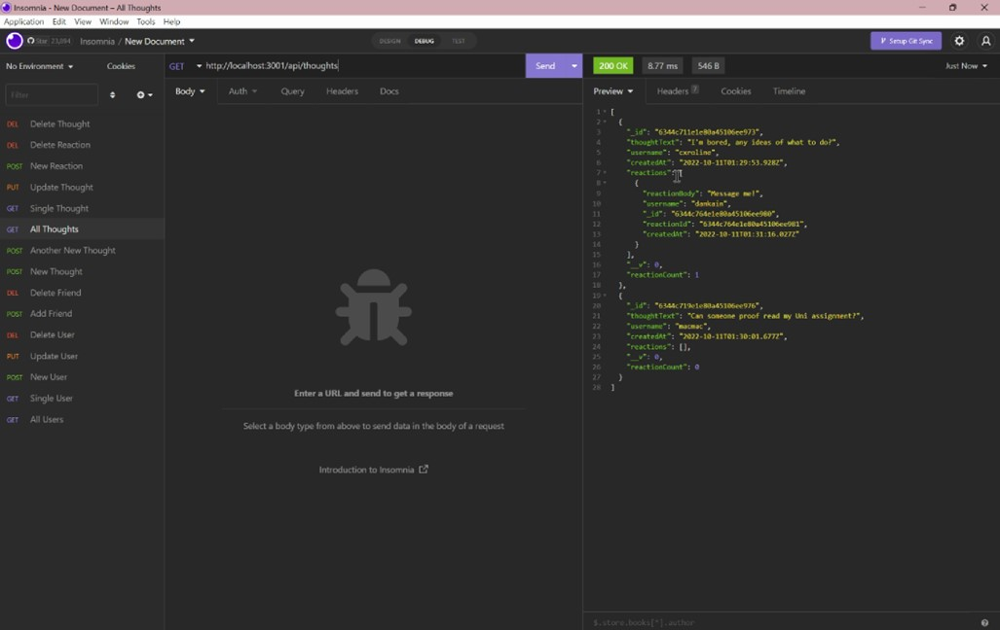

# Social Network API
## Description
This project is an API social network web application where users can share their thoughts, react to friends' thoughts, and create a friends list. Express.js has been used for routing, MongoDB for the database, and Mongoose ODM.

---
## Table of Contents
1. [User Story](#user-story)
1. [Acceptance Criteria](#acceptance-criteria)
1. [Usage](#usage)
1. [Screenshots](#screenshots)
1. [Links](#links)

---
## User Story
```
AS A social media startup
I WANT an API for my social network that uses a NoSQL database
SO THAT my website can handle large amounts of unstructured data
```

---
## Acceptance Criteria
```
GIVEN a social network API
WHEN I enter the command to invoke the application
THEN my server is started and the Mongoose models are synced to the MongoDB database
WHEN I open API GET routes in Insomnia for users and thoughts
THEN the data for each of these routes is displayed in a formatted JSON
WHEN I test API POST, PUT, and DELETE routes in Insomnia
THEN I am able to successfully create, update, and delete users and thoughts in my database
WHEN I test API POST and DELETE routes in Insomnia
THEN I am able to successfully create and delete reactions to thoughts and add and remove friends to a user’s friend list
```

---
## Usage
To use the application, open file directory and enter command 'npm i && npm run seed && npm start'

---
## Screenshots






---
## Links
GitHub: [https://github.com/carolinemae](https://github.com/carolinemae/tech-blog)

Demo Video: [https://drive.google.com/file](https://drive.google.com/file/d/1d2S2kHGQqPaqk96-dZssi15VVRpigyU3/view)

Email: [carolinemaee@live.com](mailto:carolinemaee@live.com)

[Back to top](#social-media-api)